**University of Pennsylvania, CIS 5650: GPU Programming and Architecture,
Project 1 - Flocking**

* Logan Dooley
  * [LinkedIn](https://www.linkedin.com/in/logan-dooley-a205a619a/)
* Tested on: Windows 11, 13th Gen Intel(R) Core(TM) i5-13420H (2.10 GHz), 16GB RAM, RTX 4050 Laptop

## Table of Contents
* [Overview](#overview)
* [Background](#background)
* [Methodology](#methodology)
* [Performance Analysis](#performance-analysis)
* [Extra Credit/Features](#extra-creditfeatures)
* [CMake Changes](#cmake-changes)
* [Build Information](#build-information)

## Overview

This project is a CUDA implementation of Boids, which is based off of Craig Reynold's original paper, "Flocks, Herds, and Schools: A Distributed Behavioral Model". This project also extends a base boid implementation to an application which uses the boids as an audio-visualizer for input sound files from the user. This is done by analyzing the sound waves using the cuFFT library to generate bass, mid, and high song features which are used to affect boid rules.

### Examples

#### 5000 Boids

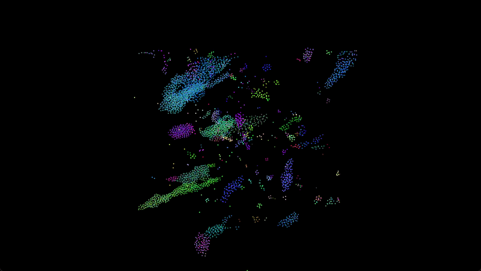

#### 100000 Boids

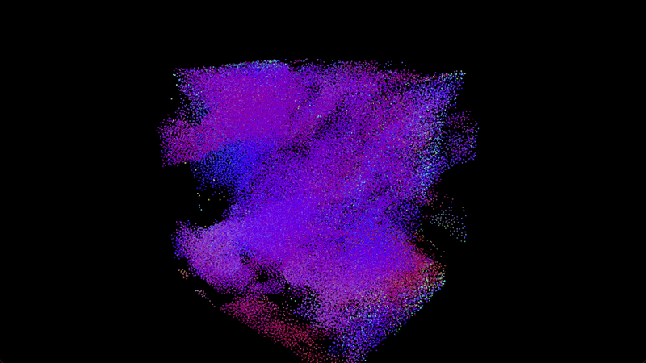

#### Audio Visualizer (Click the image to be taken to the YouTube video)
[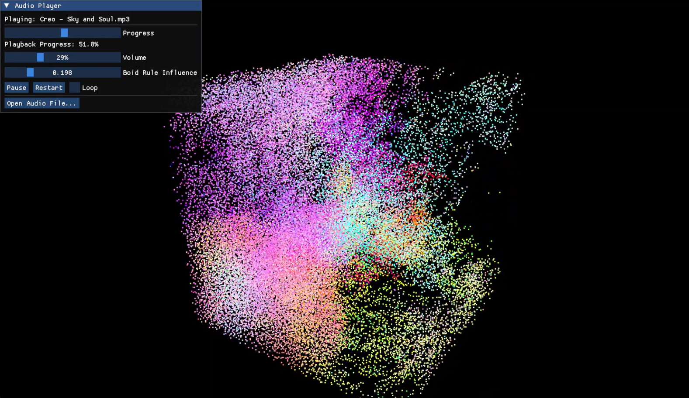](https://www.youtube.com/watch?v=X_MBObliUEY)

## Background
A boid, a word that comes from "bird-oid", is a representation of a flocking agent which uses information about its neighbors to inform how it moves. In this implementation, each boid follows 3 rules:

| Rule | Description | Effect on Behavior |
| :---     | :---:    | :---:     |
| Cohesion | Each boid is attracted to the perceived center of its neighbors. | Stray boids will be drawn into nearby groups. |
| Separation | Each boid is repulsed from nearby boids. | Boids will not collide with one another. |
| Alignment | Each boid prefers to match the velocity of its neighbors. | Boids will move together as a herd rather than crossing paths with one another. |

## Methodology

### Naive Method

For the naive method, each thread corresponds to a single boid. They then loop through all other boids in the simulation and do distance checks regardless. This is an O(n^2) approach to this problem.

### Uniform Grid

To optimize and reduce the number of neighbors we need to check, a common approach is to use a spatial acceleration structure called a uniform grid. In this setup we subdivide the space into cells and assign each boid to a cell. Then when we are checking for neighbors, we only have to check for neighbors in a select few surrounding cells depending on the radii of the boid rules. This provides a significant speedup over the naive approach especially with larger areas.

### Uniform Grid with Coherent Position and Velocity Arrays

The uniform grid approach results in threads needing to use a layer of indirection to map from cell -> boid index -> position + velocity index -> position + velocity. However if we sort the position and velocity arrays after binning our boids into cells, we can remove the layer of indirection from boid index -> position + velocity index to just get cell -> position + velocity index -> position + velocity. This helps reduce the total amount of global memory as well as speed up the lookup process. 

### Audio Processing

For audio processing, I used the miniaudio library for extracing and processing PCM samples, and fed those into the cuFFT library to extract frequencies. I then launched a single thread kernel to sum the bass, mid, and treble on the GPU, and used those to influence the 3 boid rules of cohesion, separation, and alignment, as well as the maximum boid speed. I also exposed an audio player interface via Dear ImGui.

## Performance Analysis

### Effect of Boid Count on FPS

For these tests, I used a block size of 128 threads per block and tested between the Naive, Uniform Grid, and Uniform Grid with Coherent Position and Velocity arrays.

Without visualizing the boids, the following graph shows the comparison:
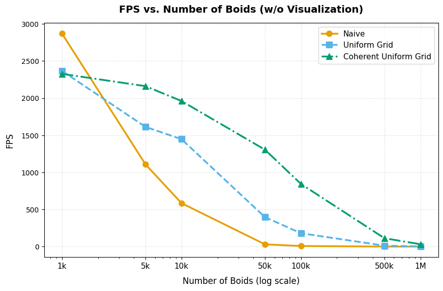

Adding in visualization, we see the following:
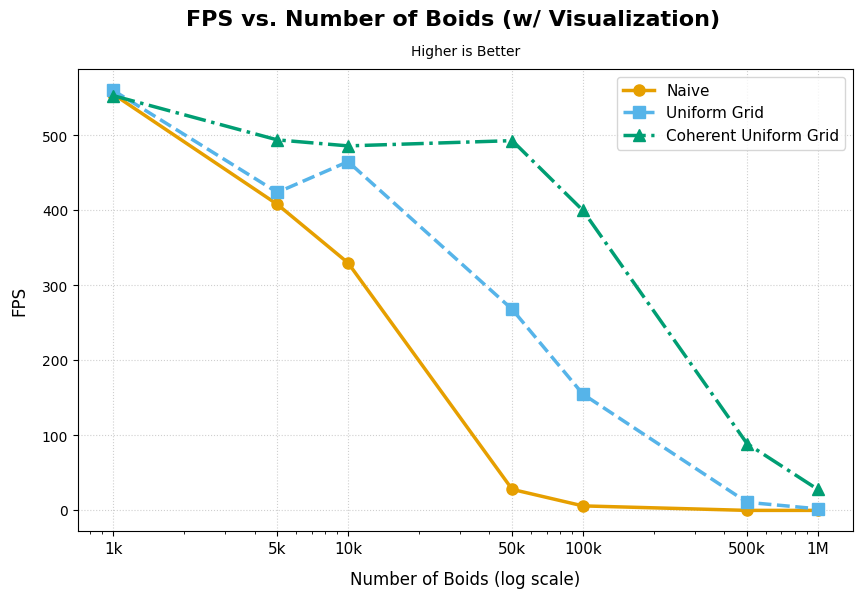

Notice that with visualization, for the Uniform Grid, there starts to be a decline between 10k and 50k boids, and for the Coherent Uniform Grid the decline is between 50k and 100k boids. This is likely because these are thresholds in which we become bottlenecked by the boid simulation as opposed to the visualization.

#### Analysis
In the following graph of plotting the ms / Frame vs squared boid counts in the naive implementation, we see that it forms a straight line. This supports the hypothesis that the naive implementation scales as O(n^2).
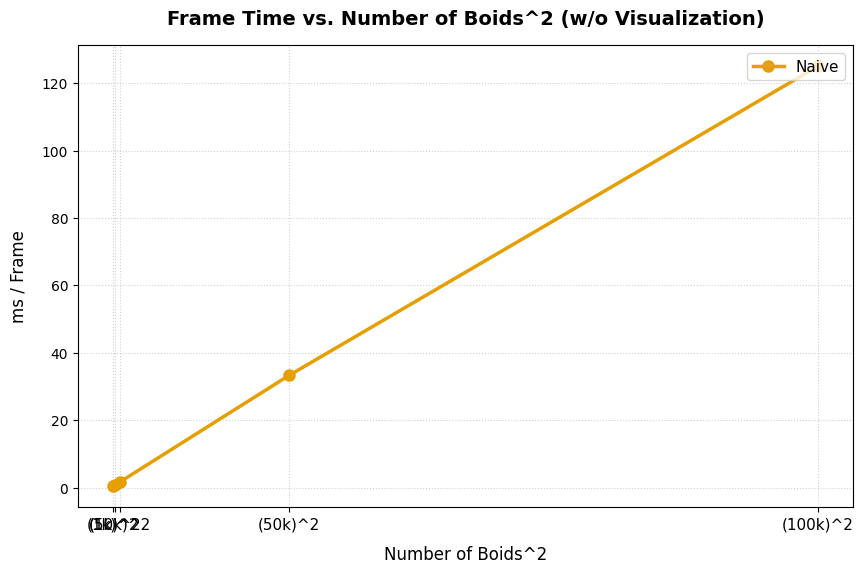

On the other hand, we see that with a uniform grid and a coherent uniform grid the decrease in FPS strays away from the O(n^2) naive implementation. Algorithmically, there still is an n^2 term in the scaling with a uniform grid due to boid density, however the constant in front of it is much smaller as we are only looking at a fixed subset of the total number of particles.

#### Effect of Coherence
We also see that the coherent uniform grid consistently performs better than its non-coherent counterpart. This is expected because having removed a layer of indirection, it reduces a global memory access per neighbor check, and global memory accesses are a large bottleneck in GPU programs. Additionally, it ensures that our position and velocity accesses are spatially coherent in memory, so improves cache performance.

### Effect of Cell Size on FPS

For this test, I used a block size of 128 threads per block and tested using the Uniform Grid with Coherent Position and Velocity arrays. In this case, R represents the largest radius in which boids are searching for neighbors. In the first case where cell size = R, for any boid we search all 26 neighboring cells as well as its own, but when cell size = 2R, we only search in a 2x2x2 range of 8 cells around each boid. 

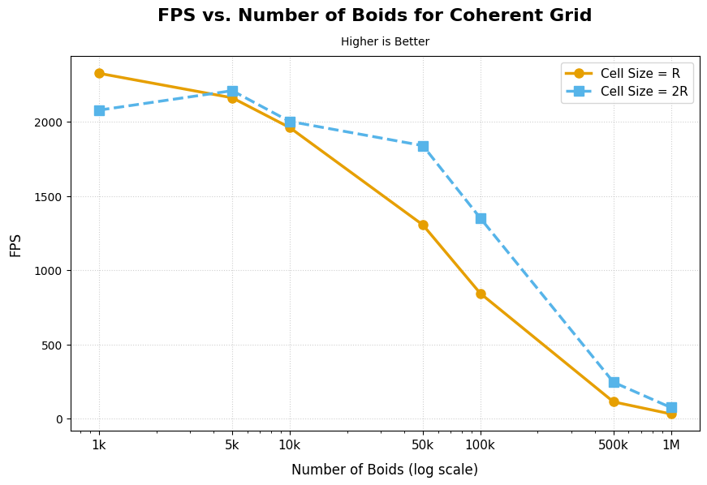

For this analysis we see mostly that the case of checking 27 cells with a cell width of R is more performant than checking 8 cells with a cell width of 2R. This might be somewhat unexpected since by only checking 8 cells in the coherent grid case, we are checking 8 segments of consecutive pieces of memory, whereas for the other case we are checking 27 segments of consecutive pieces of memory. However, it is possible that the overhead of checking more segments is not as important, since grid cells are indexed in 1D firstly in X, then in Y, and finally in Z, and I check them in the same order when evaluating neighbors, a row of 3 cells in X are actually consecutive in memory. This means that we are really checking 9 segments of consecutive pieces of memory in reality. Additionally, checking a 2x2x2 region of cells with radius 2R means we are checking a total cube with side length 4R. On the other hand, checking a 3x3x3 region of cells with radius R means we are checking a total cube with side length 3R. This means that less boids have to undergo distance checks in the 27 cell checking scenario than in the 8 cell checking scenario, which can contribute to the speedup shown.

### Effect of Block Size on FPS

For these tests I used a consistent boid count of 25k across the Naive, Uniform Grid, and Uniform Grid with Coherent Position and Velocity arrays implementations. I then tested performance against power of 2 multiples of 32, the size of a warp in CUDA.

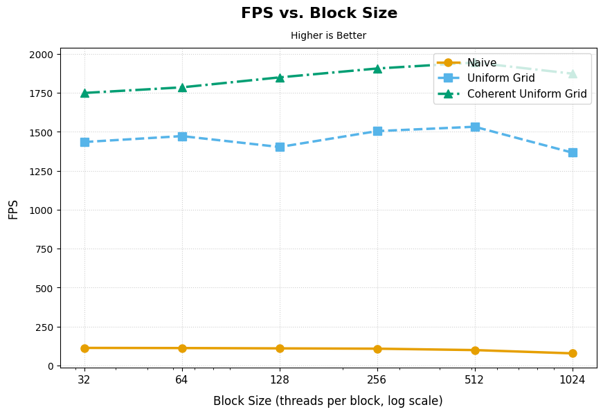

For the most part, we see that there is little impact of block size on the performance of the application. However, there is a noticable dip between 512 and 1024. This may be because of register pressure due to twice as many registers being needed with 1024 threads per block compared to 512. 

## Extra Credit/Features

### Dynamic Grid Checking

For this project I added a preprocessor definition for "DYNAMIC_GRID" which when enabled, will determine how many neighbor cells to check at runtime based on the boid rule distances and the current cell widths. It is compatible with both the scattered and coherent uniform grids, and is automatically enabled when using the audio visualizer mode via the "AUDIO_VISUALIZE" preprocessor definition

What this mode does is it will adjust the cells it searches based on the grid cell size. This means if the grid cell has a size that is 0.5 times the max radius for neighbor searches, we would have to search 2 cells outwards in each direction to cover an entire radii.

For a uniform grid with coherent accesses and 500k boids, the FPS vs. cell size with respect to the boid rule radii is as follows:

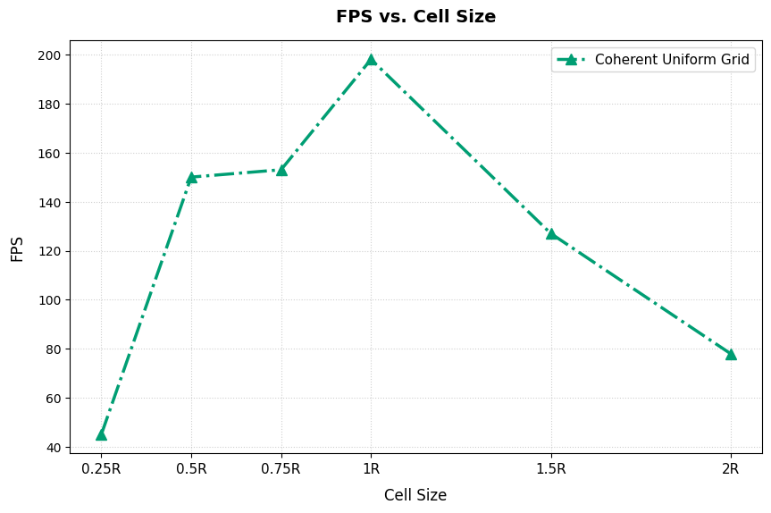

Here we see that there is a maximum when the cell size is equal to the max radii of the boid rules. This is likely the case since having smaller cells means that you have to search more individual cells for boids, but once the cell size gets too large, while you search fewer cells, those cells have more boids into them to compare against. 

### Audio Visualization

As a fun extension, I made my boids simulation into an audio visualizer. This can be enabled via the preprocessor def "AUDIO_VISUALIZE" in main.cpp. The way this works is the audio data is processed into frequencies via the cuFFT library, and then used to scale the various boid rule strengths as well as max boid speed.

The audio player interface is made with Dear ImGui and looks like this upon launch:

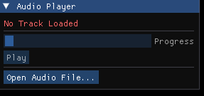

If you click the "Open Audio File..." button, it will prompt you with a file dialog in which you can choose any audio file you wish (primarily mp3). It will then start playing immediately and the interface will then look like the following:

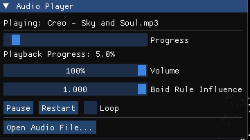

The top text is the audio file's name being played.
The next bar is a progress bar of the audio file which you can manually slide to skip to different parts in the file.
This is followed by a Volume slider which scales how loud the audio plays, separatly from your desktop speaker volume.
Then, there is a slider for "Boid Rule Influence" which controls how strong the song is in influencing the boid rules. This is necessary since different songs have different balancing as well as lows and highs in terms of volume intensity, which impact the rules. 
Finally, there are 2 buttons and a checkbox for play/paus, restarting the track, and looping the track. If Loop is checked, when the track progress hits 100%, it will immediately loop back around and play again.

## CMake Changes

For the audio visualizer, I modified the CMakeLists.txt to integrate the Dear ImGUI, miniaudio, and Native File Dialogues extended libraries. These library files are either included as submodules in the cses of ImGUI and NFDe, or the files are directly included in the projectin the case of miniaudio.

## Build Information

There is a collection of preprocessor defs that change the behaivor of the project. They are to be used as follows:

| Preprocessor Def | File | Effect on Behavior |
| :---     | :---:    | :---:     |
| VISUALIZE | main.cpp | When set to 1, boids will show visually in the GLFW window. |
| UNIFORM_GRID | main.cpp | When set to 1, a uniform grid will be used to spatially accelerate nearest neighbor searches. |
| COHERENT_GRID | main.cpp | When set to 1 alongside UNIFORM_GRID, a uniform grid will be used to spatially accelerate nearest neighbor searches. Position and velocity arrays will be reordered to be spatially coherent in nearest neighbor searches. |
| RADIUS_2R | kernel.cu | When set to 1 alongside using UNIFORM_GRID, grid cells will be given a radius equal to twice that of the farthest boid rule. In neighbor searches, a 2x2x2 region of cells will be searched. |
| DYNAMIC_GRID | kernel.cu | When set to 1 alongside RADIUS_2R NOT being set, grid cells will be searched dynamically based on the farthest boid rule. This is useful if the grid cell size is set to something other than 1R, or if boid rule distances change at runtime. |
| AUDIO_VISUALIZE | main.cpp | When set to 1, an audio visualizer will be used for the boids. This will display an ImGui UI for audio selection, and will automatically use a spatially coherent uniform grid with dynamic grid cell searching. |